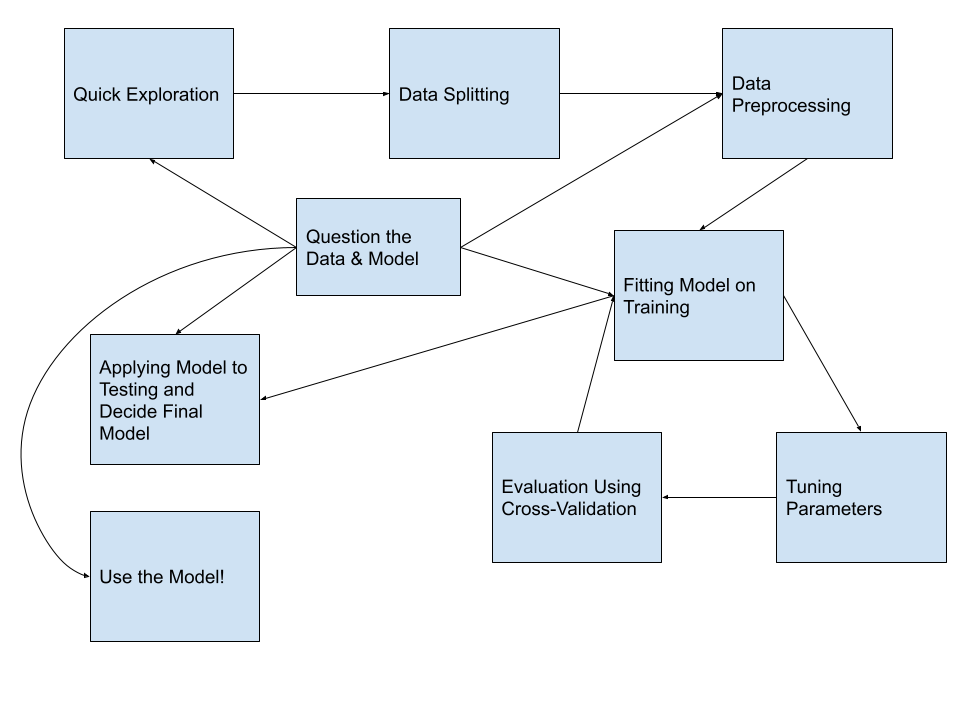

## Resources

Here are some great resources. I will reference some of them throughout.

* [Hands on Machine Learning with R](https://bradleyboehmke.github.io/HOML/) (HOML, for short) by Bradley Boehmke and Brandon Greenwell is the textbook I used in the Machine Learning course I taught in spring of 2020. It is a great place to go to review some of the model algorthims and concepts.  

* [ISLR](https://www.statlearning.com/) by James, Witten, Hastie, and Tibshirani goes deeper into the math of the algorithms. You can download their book at this site.

* Tidymodels
  - [Lisa's tidymodels noRth presentation](https://youtu.be/tVZO-aoXStE) gives an example of using `tidymodels`. I will go through it below.
  - [tidymodels.org](https://www.tidymodels.org/), specifically the [case study](https://www.tidymodels.org/start/case-study/), walks through examples of using the `tidymodels` suite
  - [Tidy Models with R textbook](https://www.tmwr.org/) by Julia Silge and Max Kuhn provides more in-depth explanations of the `tidymodels` functions with extended examples.
  - [Julia Silge's blog](https://juliasilge.com/) with even more examples!

## Review

Most of you probably learned about machine learning algorithms using the `caret` R package. Before jumping into the new `tidymodels` package, let's remember some of the key machine learning concepts. 

Let's start with an overview of the process. You covered many of these in your machine learning course. If you need more of a refresher than what I provide, see the [*Modeling Process*](https://bradleyboehmke.github.io/HOML/process.html) chapter of HOML.

<div class="centered">


</div>

And let's review what we do during each of these steps.

1. **Quick exploration**: Read in the data, check variable types, find which values each variable takes and how often, check distributions of quantitative variables, explore missing values. DO NOT do any modeling or transforming of data in this step.  
2. **Data splitting**: Split the data into training and testing sets. The testing dataset will not be used again until the very end. 
3. **Data pre-processing**: More in-depth data exploration, feature engineering, variable transformations. This step is usually pretty time-consuming.  
4. **Fitting model(s)**: Fit the models of interest on the training data.  
5. **Tuning parameters**: If the model in the previous step involved tuning parameters, use cross-validation (or similar method) to find the best parameter.  
6. **Evaluate & compare models**: Use cross-validation to evaluate the model. If you have a large number of models you are evaluating, you will probably limit the set of models to your best/favorite few during this step. The image below is to help you remember that process, which I have also written about below.


  - In $k$-fold cross-validation, we divide the data randomly into $k$ approximately equal groups or *folds*. The schematic here shows 5-fold cross-validation.  
  - The model is fit on $k-1$ of the folds and the remaining fold is used to evaluate the model. Let's look at the first row in the schematic. Here the model is fit on the data that are in folds 2, 3, 4, and 5. The model is evaluated on the data in fold 1.  
  - RMSE is a common performance metric for models with a quantitative response. It is computed by taking the difference between the predicted and actual response for each observation, squaring it, and taking the square root of the average over all observations. Or, as a formula:
  
$$
RMSE = \sqrt{\frac{1}{n}\sum_{i=1}^n(y_i - \hat{y}_i)^2},
$$

  - So, again looking at the first row in the schematic, the model is fit to folds 2, 3, 4, and 5 and we would use that model to compute the RMSE for fold 1. In the second row, the model is fit to the data in folds 1, 3, 4, and 5 and that model is used to compute the RMSE for the data in the 2nd fold.  
 - After this is done for all 5 folds, we take the average RMSE, to obtain the overall performance. This overall error is sometimes called the CV error. Averaging the performance over $k$ folds gives a better estimate of the true error than using one hold-out set. It also allows us to estimate its variability.
 - For models with a categorical response, a common performance metric to evaluate a model is accuracy: out of all cases, fraction of correct (true positives and true negatives) classifications. A cross-validated accuracy would be computed in a similar way to the cross-validated RMSE described above.

7. **Apply final few models to testing data**: After we limit the number of models to the top few, we will want to to apply it to the testing data, the data that hasn't been used at all during the modeling process. This will give us a measure of the model's performance and may help us make a final decision about which model to use. 

8. **Use the model!**: This step may be simple, like applying the model to a single set of data, or it could be a lot more complex, requiring the model to be "put into production" so it can be applied to new data in real-time.

9. **Question the data and model**: This isn't really a single step but something that we should be doing through the modeling process. We should be working closely with people who know the data well so we assure that we are interpreting and using it correctly. And we should evaluate how the model might be used in new contexts, especially keeping in mind how the model could be used to do harm. 

## Using `tidymodels` for the process

In this section, I will show how we can use the `tidymodels` framework to execute the modeling process. 

First, let's load some of the libraries we will use:

```{r}
library(tidyverse)     # for plotting and wrangling
library(tidymodels)    # for modeling ... tidily 
library(moderndive)    # for some data
```


