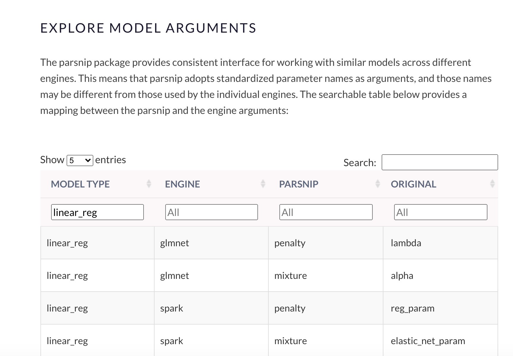

```{r setup, include=FALSE}
knitr::opts_chunk$set(echo = TRUE,
                      message = FALSE,
                      warning = FALSE,
                      error = TRUE)
```

```{r echo=FALSE}
library(emo)          # for emojis!   
library(downloadthis) # for including download buttons for files
```

```{r paged-table, echo=FALSE}
# define a method for objects of the class data.frame
# see https://github.com/rstudio/distill/issues/310#issuecomment-797541459
library(knitr)
knit_print.data.frame <- function(x, ...) {
  asis_output(
    rmarkdown:::paged_table_html(x, options = attr(x, "options")),
    meta = list(dependencies = rmarkdown:::html_dependency_pagedtable())
  )
}
registerS3method("knit_print", "data.frame", knit_print.data.frame)
```

## Follow along

You can download this .Rmd file below if you'd like to follow along. I do have a few hidden notes you can disregard. This document is a distill_article, so you may want to change to an html_document to knit. You will also need to delete any image references to properly knit, since you won't have those images.

```{r, echo=FALSE}
download_file(
  path = "ml-review.Rmd",
  button_label = "Download .Rmd file",
  button_type = "info",
  has_icon = TRUE,
  icon = "fa fa-save",
  self_contained = FALSE
)
```

## Resources

Here are some great resources. I will reference some of them throughout.

* [Hands on Machine Learning with R](https://bradleyboehmke.github.io/HOML/) (HOML, for short) by Bradley Boehmke and Brandon Greenwell is the textbook I used in the Machine Learning course I taught in spring of 2020. It is a great place to go to review some of the model algorithms and concepts.  

* [ISLR](https://www.statlearning.com/) by James, Witten, Hastie, and Tibshirani goes deeper into the math of the algorithms. You can download their book at this site.

* Tidymodels
  - [Lisa's tidymodels noRth presentation](https://youtu.be/tVZO-aoXStE) gives an example of using `tidymodels`. I will go through the same example below, with a few added parts. The code has changed slightly in some places, too.
  - [tidymodels.org](https://www.tidymodels.org/), specifically the [case study](https://www.tidymodels.org/start/case-study/), walks through examples of using the `tidymodels` suite.  
  - [Tidy Models with R textbook](https://www.tmwr.org/) by Julia Silge and Max Kuhn provides more in-depth explanations of the `tidymodels` functions with extended examples.
  - [Julia Silge's blog](https://juliasilge.com/) with even more examples!

## Review

Most of you probably learned about machine learning algorithms using the `caret` R package. Before jumping into the new `tidymodels` package, let's remember some of the key machine learning concepts. 

Let's start with an overview of the process. You covered many of these in your machine learning course. If you need more of a refresher than what I provide, see the [*Modeling Process*](https://bradleyboehmke.github.io/HOML/process.html) chapter of HOML.

<div class="centered">


</div>

And let's review what we do during each of these steps.

1. **Quick exploration**: Read in the data, check variable types, find which values each variable takes and how often, check distributions of quantitative variables, explore missing values. DO NOT do any modeling or transforming of data in this step.  
2. **Data splitting**: Split the data into training and testing sets. The testing dataset will not be used again until the very end. 
3. **Data pre-processing**: More in-depth data exploration, feature engineering, variable transformations. This step is usually pretty time-consuming.  
4. **Fitting model(s)**: Fit the models of interest on the training data.  
5. **Tuning parameters**: If the model in the previous step involved tuning parameters, use cross-validation (or similar method) to find the best parameter.  
6. **Evaluate & compare models**: Use cross-validation to evaluate the model. If you have a large number of models you are evaluating, you will probably limit the set of models to your best/favorite few during this step. The image below is to help you remember that process, which I have also written about below.

{width=80% .external}

  - In $k$-fold cross-validation, we divide the data randomly into $k$ approximately equal groups or *folds*. The schematic here shows 5-fold cross-validation.  
  - The model is fit on $k-1$ of the folds and the remaining fold is used to evaluate the model. Let's look at the first row in the schematic. Here the model is fit on the data that are in folds 2, 3, 4, and 5. The model is evaluated on the data in fold 1.  
  - RMSE is a common performance metric for models with a quantitative response. It is computed by taking the difference between the predicted and actual response for each observation, squaring it, and taking the square root of the average over all observations. Or, as a formula:
  
$$
RMSE = \sqrt{\frac{1}{n}\sum_{i=1}^n(y_i - \hat{y}_i)^2},
$$

  - So, again looking at the first row in the schematic, the model is fit to folds 2, 3, 4, and 5 and we would use that model to compute the RMSE for fold 1. In the second row, the model is fit to the data in folds 1, 3, 4, and 5 and that model is used to compute the RMSE for the data in the 2nd fold.  
 - After this is done for all 5 folds, we take the average RMSE, to obtain the overall performance. This overall error is sometimes called the CV error. Averaging the performance over $k$ folds gives a better estimate of the true error than using one hold-out set. It also allows us to estimate its variability.
 - For models with a categorical response, a common performance metric to evaluate a model is accuracy: out of all cases, the fraction of correct (true positives and true negatives) classifications. A cross-validated accuracy would be computed in a similar way to the cross-validated RMSE described above.

7. **Apply final few models to testing data**: After we limit the number of models to the top few, we will want to to apply it to the testing data, the data that hasn't been used at all during the modeling process. This will give us a measure of the model's performance and may help us make a final decision about which model to use. 

8. **Use the model!**: This step may be simple, like applying the model to a single set of data, or it could be a lot more complex, requiring the model to be "put into production" so it can be applied to new data in real-time.

9. **Question the data and model**: This isn't really a single step but something that we should be doing through the modeling process. We should be working closely with people who know the data well so we assure that we are interpreting and using it correctly. And we should evaluate how the model might be used in new contexts, especially keeping in mind how the model could be used to do harm. 

## Using `tidymodels` for the process

In this section, I will show how we can use the `tidymodels` framework to execute the modeling process. I've updated the diagram from above to include some of the libraries and functions we'll use throughout the process. 

<center>


</center>

First, let's load some of the libraries we will use:

```{r libraries}
library(tidyverse)         # for reading in data, graphing, and cleaning
library(tidymodels)        # for modeling ... tidily
library(glmnet)            # for regularized regression, including LASSO
library(naniar)            # for examining missing values (NAs)
library(lubridate)         # for date manipulation
library(moderndive)        # for King County housing data
library(vip)               # for variable importance plots
library(rmarkdown)         # for paged tables
theme_set(theme_minimal()) # my favorite ggplot2 theme :)
```

Read in the King County Housing data and take a look at the first 5 rows.

```{r data}
data("house_prices")

house_prices %>% 
  slice(1:5)
```

Now, we will dig into each of the modeling steps listed above.

### 1. Quick exploration

Take a quick look at distributions of all the variables to check for anything irregular. 

Quantitative variables:

```{r expl_quant, fig.width=6, fig.height=4}
house_prices %>% 
  select(where(is.numeric)) %>% 
  pivot_longer(cols = everything(),
               names_to = "variable", 
               values_to = "value") %>% 
  ggplot(aes(x = value)) +
  geom_histogram(bins = 30) +
  facet_wrap(vars(variable), 
             scales = "free")
```

Things I noticed and pre-processing thoughts:

* Right-skewness in `price` and all variables regarding square footage --> log transform if using linear regression.

* Many 0's in `sqft_basement`, `view`, and `yr_renovated` --> create indicator variables of having that feature vs. not, ie. a variable called `basement` where a `0` indicates no basement (`sqft_basement` = 0) and a `1` indicates a basement (`sqft_basement` > 0).  

* Age of home may be a better, more interpretable variable than year built --> `age_at_sale = year(date) - yr_built`.

Categorical variables:

```{r expl_cat}
house_prices %>% 
  select(where(is.factor)) %>% 
  pivot_longer(cols = everything(),
               names_to = "variable", 
               values_to = "value") %>% 
  ggplot(aes(x = value)) +
  geom_bar() +
  facet_wrap(vars(variable), 
             scales = "free", 
             nrow = 2)
```

Things I noticed and pre-processing thoughts:

* `condition` and `grade` both have levels with low counts --> make fewer categories.  
* `zipcode` has many unique levels --> don't use that variable for now.  
* We might consider using the month the house was sold as a variable:

```{r}
house_prices %>% 
  count(month = month(date, label = TRUE)) %>% 
  ggplot() +
  geom_col(aes(x = month, y = n))
```

* And, we quickly look at the counts for the `waterfront` variable. Not many houses are waterfront properties.  

```{r}
house_prices %>% 
  count(waterfront)
```

* The only other variable is `id` which isn't used in modeling.
 
* Before moving on, let's use the `add_n_miss()` function from the `naniar` library to see if we have any missing values. And it appears that there aren't any missing values - lucky us!

```{r}
house_prices %>% 
  add_n_miss() %>% 
  count(n_miss_all)
```


### 2. Data splitting

**NOTE**: I start by doing some manipulating of the dataset to use `log_price` as the response variable rather than `price`. I originally did this using a `step_log()` function after a `recipe()` function (see the next section), but read in this [RStudio Community post](https://community.rstudio.com/t/fit-resamples-prep-and-outcome-transform-behavior/83891/2), in the comment by Max Kuhn, that it's better to transform the outcome before doing the modeling. There is also a discussion of this in the [Skipping steps for new data](https://www.tmwr.org/recipes.html#skip-equals-true) section of the Kuhn & Silge *Tidy Modeling with R* book.

Then, we split the data into  training and testing datasets. We use the training data to fit different types of models and to tune parameters of those models if needed, and to help us choose our best models (or maybe best few). The testing dataset is saved for the very end to compare a small subset of models and to give an estimate of the performance on data the model hasn't seen. The `initial_split()` function from the `rsample` library (part of `tidymodels`) is used to create this split. We just do random splitting with this dataset, but there are other arguments that allow you to do stratified sampling. Then we use `training()` and `testing()` to extract the two datasets, `house_training` and `house_testing`. 

```{r init_split}
set.seed(327) #for reproducibility

house_prices <- house_prices %>% 
  mutate(log_price = log(price, base = 10)) %>% 
  select(-price)

# Randomly assigns 75% of the data to training.
house_split <- initial_split(house_prices, 
                             prop = .75)
house_split
#<training/testing/total>

house_training <- training(house_split)
house_testing <- testing(house_split)
```

### 3. Data pre-processing

This step may  not seem very time consuming in this example, but you will often come back to this step and spend a lot of time trying different variable transformations. You should make sure to work closely with the people who use and create the data during this step. They are a crucial part of the process.

* We use the `recipe()` function to define the response/outcome variable and the predictor variables. 

* A variety of `step_xxx()` functions can be used to do any data pre-processing/transforming. Find them all [here](https://www.tidymodels.org/find/recipes/). I used a few, with brief descriptions in the code. I also used some selector functions, like `all_predictors()` and `all_nominal()` to help me select the right variables. For suggestions on which `step_xxx()` functions to use with which engines, see this list of functions with [example templates](https://usemodels.tidymodels.org/reference/templates.html#examples). (Thank you Alison Hill, for showing me this resource via [R Studio Community](https://community.rstudio.com/t/tidymodels-lasso-scaled-variables/99256).)

* One thing that is different here from what you might be used to is that we explicitly make dummy variables with the `step_dummy()` function. We don't need to always do that - it depends on the model we use. The [recommended preprocessing](https://www.tmwr.org/pre-proc-table.html) appendix of the *Tidy Modeling with R* book is a good place to look for reference.  

* We also use `step_normalize()` here to center and scale our numeric predictor variables. Even though this is the default in the `glmnet` engine (see next step), this is important to ensure that this step happens with new data.

* The `update_roles()` function is used to change the roles of some variables. For us, these are variables we may want to include for evaluation purposes but will not be used in building the model. I chose the role of `evaluative` but you could name that role anything you want, eg. `id`, `extra`, `junk` (maybe a bad idea?).

```{r recipe}
house_recipe <- recipe(log_price ~ ., #short-cut, . = all other vars
                       data = house_training) %>% 
  # Pre-processing:
  # Remove, redundant to sqft_living and sqft_lot
  step_rm(sqft_living15, sqft_lot15) %>%
  # log sqft variables (without price)
  step_log(starts_with("sqft"),
           -sqft_basement, 
           base = 10) %>% 
  # I originally had the step_log() function below
  # but instead did the transformation before
  # the recipe because this will mess up the 
  # predict() function
  # step_log(price, base = 10) %>% 
  
  # new grade variable combines low grades & high grades
  # indicator variables for basement, renovate, and view 
  # waterfront to numeric
  # age of house
  step_mutate(grade = as.character(grade),
              grade = fct_relevel(
                        case_when(
                          grade %in% "1":"6"   ~ "below_average",
                          grade %in% "10":"13" ~ "high",
                          TRUE ~ grade
                        ),
                        "below_average","7","8","9","high"),
              basement = as.numeric(sqft_basement == 0),
              renovated = as.numeric(yr_renovated == 0),
              view = as.numeric(view == 0),
              waterfront = as.numeric(waterfront),
              age_at_sale = year(date) - yr_built)%>% 
  # Remove sqft_basement, yr_renovated, and yr_built
  step_rm(sqft_basement, 
          yr_renovated, 
          yr_built) %>% 
  # Create a month variable
  step_date(date, 
            features = "month") %>% 
  # Make these evaluative variables, not included in modeling
  update_role(all_of(c("id",
                       "date",
                       "zipcode", 
                       "lat", 
                       "long")),
              new_role = "evaluative") %>% 
  # Create indicator variables for factors/character/nominal
  # explicitly remove outcome, even though outcome isn't nominal
  # this is important in cases when we have a nominal output (eg. logistic)
  step_dummy(all_nominal(), 
             -all_outcomes(), 
             -has_role(match = "evaluative")) %>% 
  step_normalize(all_predictors(), 
                 -all_nominal())
```

Apply to training dataset, just to see what happens. This is not a necessary step, but I often like to check to see that everything is as expected. For example, notice the names of the variables are the same as before but they have been transformed, eg. `sqft_living` is actually log base 10 of square feet of living. This confused me the first time, so I was glad I ran this extra step. Better to be confused now than later in the process `r emo::ji("grinning_face")`.

```{r apply_recipe}
house_recipe %>% 
  prep(house_training) %>%
  # using bake(new_data = NULL) gives same result as juice()
  # bake(new_data = NULL)
  juice() 
```
  
### 4. Fitting model(s)

Now that we have split and pre-processed the data, we are ready to model! First, we will model `log_price` using simple linear regression.

We will do this using some modeling functions from the `parsnip` package. Find all available functions [here](https://www.tidymodels.org/find/parsnip/). [Here](https://parsnip.tidymodels.org/reference/linear_reg.html) is the detail for linear regression.

In order to define our model, we need to do these steps:

* Define the model type, which is the general type of model you want to fit.    
* Set the engine, which defines the package/function that will be used to fit the model.  
* Set the mode, which is either "regression" for continuous response variables or "classification" for binary/categorical response variables. (Note that for linear regression, it can only be "regression", so we don't NEED this step in this case.)  
* (OPTIONAL) Set arguments to tune. We'll see an example of this later.

```{r linear_mod}
house_linear_mod <- 
  # Define a linear regression model
  linear_reg() %>% 
  # Set the engine to "lm" (lm() function is used to fit model)
  set_engine("lm") %>% 
  # Not necessary here, but good to remember for other models
  set_mode("regression")

house_linear_mod
```

This is just setting up the process. We haven't fit the model to data yet, and there's still one more step before we do - creating a workflow! This combines the preprocessing and model definition steps.

```{r workflow}
house_lm_wf <- 
  # Set up the workflow
  workflow() %>% 
  # Add the recipe
  add_recipe(house_recipe) %>% 
  # Add the modeling
  add_model(house_linear_mod)

house_lm_wf
```

Now we are finally ready to fit the model! After all that work, this part seems easy. We first use the `fit()` function to fit the model, telling it which data set we want to fit the model to. Then we use some other functions to display the results nicely.

```{r fit_lm}
house_lm_fit <- 
  # Tell it the workflow
  house_lm_wf %>% 
  # Fit the model to the training data
  fit(house_training)

# Display the results nicely
house_lm_fit %>% 
  pull_workflow_fit() %>% 
  tidy() %>% 
  mutate(across(where(is.numeric), ~round(.x,3))) 
```


### 6. Evaluate & compare models

(I realize we skipped #5. Don't worry, we'll get to it.)

To evaluate the model, we will use cross-validation (CV), specifically 5-fold CV. First, we set up the five folds of the training data using the `vfold_cv()` function. 

```{r cv}
set.seed(1211) # for reproducibility
house_cv <- vfold_cv(house_training, v = 5)
```

Then, we fit the model using the 5-fold dataset we just created (When I first did this, I thought I wouldn't have to do both the previous step of fitting a model on the training data AND this step, but I couldn't figure out how to extract the final model from the CV data ... so this was my solution at the time ... and it turns out you DO need to do both as noted by Julia Silge in this [RStudio Community post](https://community.rstudio.com/t/tidymodels-fastest-way-to-extract-a-model-object-from-fit-resamples-results/73301)).

```{r fit_model_cv}
set.seed(456) # For reproducibility - not needed for this algorithm

house_lm_fit_cv <-
  # Tell it the workflow
  house_lm_wf %>% 
  # Fit the model (using the workflow) to the cv data
  fit_resamples(house_cv)

# The evaluation metrics for each fold:
house_lm_fit_cv %>% 
  select(id, .metrics) %>% 
  unnest(.metrics) 

# Evaluation metrics averaged over all folds:
collect_metrics(house_lm_fit_cv)

# Just to show you where the averages come from:
house_lm_fit_cv %>% 
  select(id, .metrics) %>% 
  unnest(.metrics) %>% 
  group_by(.metric, .estimator) %>% 
  summarize(mean = mean(.estimate),
            n = n(),
            std_err = sd(.estimate)/sqrt(n))
```

### 7. Apply model to testing data

In this simple scenario, we may be interested in seeing how the model performs on the testing data that was left out. The code below will fit the model to the training data and apply it to the testing data. There are other ways we could have done this, but the way we do it here will be useful when we start using more complex models where we need to tune model parameters.

After the model is fit and applied, we collect the performance metrics and display them and show the predictions from the testing data. Notice the the RMSE here is very similar to the cross-validated RMSE we computed in the previous step. 

```{r fit_test}
house_lm_test <- 
  # The modeling work flow
  house_lm_wf %>% 
  # Use training data to fit the model and apply it to testing data
  last_fit(house_split)

# performance metrics from testing data
collect_metrics(house_lm_test)

# predictions from testing data
collect_predictions(house_lm_test) 
```

The code below creates a simple plot to examine predicted vs. actual price (log base 10) from the house data. 

```{r act_pred_plot}
collect_predictions(house_lm_test) %>% 
  ggplot(aes(x = log_price, 
             y = .pred)) +
  geom_point(alpha = .5, 
             size = .5) +
  geom_smooth(se = FALSE) +
  geom_abline(slope = 1, 
              intercept = 0, 
              color = "darkred") +
  labs(x = "Actual log(price)", 
       y = "Predicted log(price)")
```

Here is the same plot using the regular price scale.

```{r price_pred_plot}
collect_predictions(house_lm_test) %>% 
  ggplot(aes(x = 10^log_price, 
             y = 10^.pred)) +
  geom_point(alpha = .5, 
             size = .5) +
  geom_smooth(se = FALSE) +
  geom_abline(slope = 1, 
              intercept = 0, 
              color = "darkred") +
  labs(x = "Actual price", 
       y = "Predicted price") +
  scale_x_continuous(labels = scales::dollar_format(scale = .000001, 
                                                    suffix = "M")) +
  scale_y_continuous(labels = scales::dollar_format(scale = .000001, 
                                                    suffix = "M"))

```

### 9. Question the data and model

(We'll go back to step #8 in a moment)

When we use create models, it is important to think about how the model will be used and specifically how the model could do harm. One thing to notice in the graphs above is that the price of lower priced homes are, on average, overestimated whereas the price of higher priced homes are, on average, underestimated. 

What if this model was used to determine the price of homes for property tax purposes? Then lower priced homes would be overtaxed while higher priced homes would be undertaxed. 

There are many different ways we might continue to examine this model (eg. are there differences by zipcode) but for now, we'll move on.

### 8. Use the model 

How might use this model? One simple way is to predict new values. We saw that we could add the predicted values to the test data using the `collect_predictions()` function. Below, I predict the value for one new observation using the `predict()` function. We put the values of each variable in a dataset, in this case a `tibble()`. We need to have values for all the variables that were originally in the dataset passed to the `recipe()`, even the evaluation ones that don't get used in the model. We can have extra variables in there, though, like the one I have called `garbage`. I show a predicted value (for a linear model, `type = "numeric"`) and a confidence interval (`type = "conf_int"`).

**NOTE**: This is a bit of an aside, but an important one. If I would have used the `step_log()` function to transform the response variable `price` in the pre-processing step, rather than transforming it before that, we would see an error message in the `predict()` below because it would try to run that transformation step, but there wouldn't be a `price` variable. In real life, it would usually be the case that you don't have a value for the variable you are trying to predict. I originally tried to solve this problem by adding `skip = TRUE` to the `step_log()` function, but then the evaluation metrics in `collect_metrics()` compared the predicted log price to the actual price - yikes! This is discussed in a few places online - [here](https://github.com/tidymodels/workflows/issues/47)'s one. The solution is to transform the response variable before doing any of the modeling steps, as I mentioned in the Data splitting section.

```{r pred-single}
predict(
  house_lm_fit,
  new_data = tibble(id = "0705700390",
                    date = ymd("2014-09-03"),
                    bedrooms = 3,
                    bathrooms = 2.25,
                    sqft_living = 2020,
                    sqft_lot = 8379,
                    floors = 2,
                    waterfront = FALSE,
                    view = 0,
                    condition = "3",
                    grade = "7",
                    sqft_above = 2020,
                    sqft_basement = 0,
                    yr_built = 1994,
                    yr_renovated = 0,
                    zipcode = "98038",
                    lat = 47.3828,
                    long = -122.023,
                    sqft_living15 = 2020,
                    sqft_lot15 = 8031,
                    garbage = "look, it's garbage"),
  type = "numeric",
  level = 0.95
)

predict(
  house_lm_fit,
  new_data = tibble(id = "0705700390",
                    date = ymd("2014-09-03"),
                    bedrooms = 3,
                    bathrooms = 2.25,
                    sqft_living = 2020,
                    sqft_lot = 8379,
                    floors = 2,
                    waterfront = FALSE,
                    view = 0,
                    condition = "3",
                    grade = "7",
                    sqft_above = 2020,
                    sqft_basement = 0,
                    yr_built = 1994,
                    yr_renovated = 0,
                    zipcode = "98038",
                    lat = 47.3828,
                    long = -122.023,
                    sqft_living15 = 2020,
                    sqft_lot15 = 8031,
                    garbage = "look, it's garbage"),
  type = "conf_int",
  level = 0.95
)
```

We could also give it an entire dataset. Here, I just take a sample from the original dataset, add an extra variable (just to show you that you can have more than what you need), and predict with it.

```{r pred-set}
set.seed(327)

fake_new_data <- house_prices %>% 
  sample_n(20) %>% 
  mutate(extra_var = 1:20)

predict(house_lm_fit, 
        fake_new_data)
```

Since the `predict()` function will always return the same number of rows and in the same order as the dataset we put in, we can easily append the prediction to the dataset.

```{r pred-bind}
fake_new_data %>% 
  bind_cols(predict(house_lm_fit,
                    fake_new_data)) 
```

We could also add a confidence interval and use the `relocate()` function to move around some variables.

```{r pred-bind-ci}
fake_new_data %>% 
  bind_cols(predict(house_lm_fit,
                    fake_new_data)) %>% 
  bind_cols(predict(house_lm_fit,
                    fake_new_data, 
                    type = "conf_int")) %>% 
  relocate(log_price, starts_with(".pred"), 
           .after = id)
```

What if we don't want to use the model in this R session? That would be quite a common occurrence. After building a model, we would often want to save the model and use it at a later time to apply to new data. We'll get into some more complex ways of doing this eventually, but for now, let's do the following:

1. Save the model using `saveRDS()`. This model is saved to the current project folder (assuming you're using a project right now), but you could save it anywhere you'd like.

```{r}
saveRDS(house_lm_fit, "house_lm_fit.rds")
```

2. Read the model back in using `readRDS()`. Go look at `house_lm_read` in the environment, and you'll see that, indeed, it is the workflow we saved! `r emo::ji("hugging_face")`

```{r}
house_lm_read <- readRDS("house_lm_fit.rds")
```

3. Use the model we read back in to predict new data. Just like we did before, we can use the `predict()` function to predict new values. I use the same `fake_new_data` I used before.

```{r pred-bind-ci-new}
fake_new_data %>% 
  bind_cols(predict(house_lm_read,
                    fake_new_data)) %>% 
  bind_cols(predict(house_lm_read,
                    fake_new_data, 
                    type = "conf_int")) %>% 
  relocate(log_price, starts_with(".pred"), 
           .after = id)
```


### 5. Tuning model parameters

With the first model, there weren't any parameters to tune. Let's go back to step #5 and look at how the workflow changes when we have to do this extra step. 

Now we are going to try using [Least Absolute Shrinkage and Selection Operator (LASSO)](https://bradleyboehmke.github.io/HOML/regularized-regression.html#why) regression. This method shrinks some coefficients to 0 based on a penalty term. We will use cross-validation to help us find the best penalty term. 

We will set up the model similar to how we set up the linear model, but add a `set_args()` function. The `tune()` argument to the `penalty` term is a placeholder. We are telling it that we are going to tune the penalty parameter later.

```{r lasso_mod}
house_lasso_mod <- 
  # Define a lasso model 
  # I believe default is mixture = 1 so probably don't need 
  linear_reg(mixture = 1) %>% 
  # Set the engine to "glmnet" 
  set_engine("glmnet") %>% 
  # The parameters we will tune.
  set_args(penalty = tune()) %>% 
  # Use "regression"
  set_mode("regression")
```

To see the arguments available for tuning, go to the [Explore Model Arguments](https://www.tidymodels.org/find/parsnip/) section of the `parsnip` documentation and search the model type and engine you are interested in. Below I printed the arguments we can tune for `linear_reg` using `glmnet` (LASSO). We could have also tuned the `mixture` parameter, but I set it to 1 to explicitly use LASSO.

<center>

{width=80% .external}
</center>

And then we create a LASSO workflow. Notice that we're using the same recipe step that we used in the regular linear model.

```{r lasso_workflow}
house_lasso_wf <- 
  # Set up the workflow
  workflow() %>% 
  # Add the recipe
  add_recipe(house_recipe) %>% 
  # Add the modeling
  add_model(house_lasso_mod)

house_lasso_wf
```

`r emo::ji("eyes")` Here's where some of the new steps come in. We use the `grid_regular()` function from the `dials` library to choose some values of the `penalty` parameter for us. Alternatively, we could give it a vector of values we want to try.

```{r tune_grid}
penalty_grid <- grid_regular(penalty(),
                             levels = 20)
penalty_grid 
```

Then, use the `tune_grid()` function to fit the model using cross-validation for all `penalty_grid` values and evaluate on all the folds. 

```{r tune}
house_lasso_tune <- 
  house_lasso_wf %>% 
  tune_grid(
    resamples = house_cv,
    grid = penalty_grid
    )

house_lasso_tune
```

Then look at the cross-validated results in a table.

```{r tune_results}
# The rmse for each fold:
house_lasso_tune %>% 
  select(id, .metrics) %>% 
  unnest(.metrics) %>% 
  filter(.metric == "rmse")

# rmse averaged over all folds:
house_lasso_tune %>% 
  collect_metrics() %>% 
  filter(.metric == "rmse") 
```

And, even better, we can visualize the results. We can see that the RMSE stays fairly consistently low until just before $10^{-3}$

```{r tune-viz}
# Visualize rmse vs. penalty
house_lasso_tune %>% 
  collect_metrics() %>% 
  filter(.metric == "rmse") %>% 
  ggplot(aes(x = penalty, y = mean)) +
  geom_point() +
  geom_line() +
  scale_x_log10(
   breaks = scales::trans_breaks("log10", function(x) 10^x),
   labels = scales::trans_format("log10",scales::math_format(10^.x))) +
  labs(x = "penalty", y = "rmse")
```

We choose the best penalty parameter as the one with the smallest cross-validated RMSE. The `select_best()` function does this. 

```{r}
house_lasso_tune %>% 
  show_best(metric = "rmse")
```


```{r best-tune}
# Best tuning parameter by smallest rmse
best_param <- house_lasso_tune %>% 
  select_best(metric = "rmse")
best_param
```

There are other ways you can select parameters, like `select_by_one_std_err()` which "selects the most simple model that is within one standard error of the numerically optimal results". To use this, we need at least one more argument: the parameter to sort the model from most simple to most complex. So, if using glmnet's penalty parameter, since a bigger penalty will be a simpler model, I should put `desc(penalty)` in as the argument.

```{r one-se-tune}
# Best tuning parameter by smallest rmse
one_se_param <- house_lasso_tune %>% 
  select_by_one_std_err(metric = "rmse", desc(penalty))
one_se_param
```

Because a larger penalty parameter will fit a simpler model (more terms will likely go to zero). I'll go with the `one_se_param`, especially since the RMSE is so close to the "best" model's RMSE.

Once we choose the parameter we want, we adjust the workflow to include the best tuning parameter using the `finalize_workflow()` function.

```{r tune_wf}
house_lasso_final_wf <- house_lasso_wf %>% 
  finalize_workflow(one_se_param)
house_lasso_final_wf
```

Now we could fit this to the training data and look at the resulting model. We can see a few of the terms have coefficients of 0 (although not as many as I would have expected).

```{r lasso_train}
house_lasso_final_mod <- house_lasso_final_wf %>% 
  fit(data = house_training)

house_lasso_final_mod %>% 
  pull_workflow_fit() %>% 
  tidy() 
```

We can also visualize variable importance.

```{r vip}
# Visualize variable importance
house_lasso_final_mod %>% 
  pull_workflow_fit() %>% 
  vip()
```

Lastly, we apply the model to the test data and examine some final metrics. We also show the metrics from the regular linear model. It looks like performance for the LASSO model is ever so slightly better, but just barely. It's also a good sign that these RMSE's are similar to the cross-validated RMSE's.

```{r lasso_test}
# Fit model with best tuning parameter(s) to training data and apply to test data
house_lasso_test <- house_lasso_final_wf %>% 
  last_fit(house_split)

# Metrics for model applied to test data
house_lasso_test %>% 
  collect_metrics()

# Compare to regular linear regression results
collect_metrics(house_lm_test)
```

