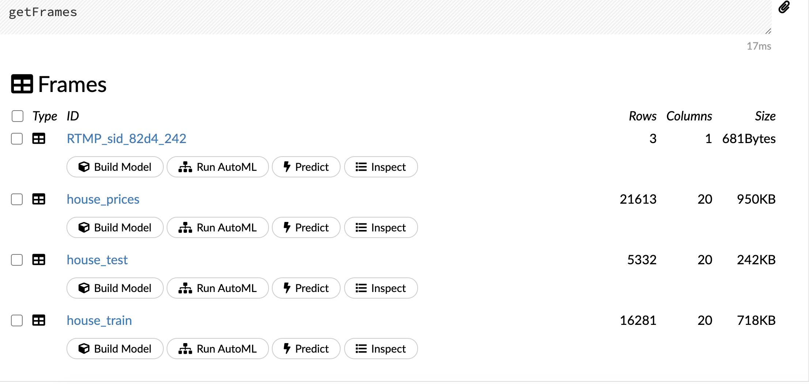

```{r setup, include=FALSE}
knitr::opts_chunk$set(echo = TRUE,
                      message = FALSE,
                      warning = FALSE,
                      error = TRUE)
```

```{r echo=FALSE}
library(emo)          # for emojis!   
library(downloadthis) # for including download buttons for files
```

```{r paged-table, echo=FALSE}
# define a method for objects of the class data.frame
# see https://github.com/rstudio/distill/issues/310#issuecomment-797541459
library(knitr)
knit_print.data.frame <- function(x, ...) {
  asis_output(
    rmarkdown:::paged_table_html(x, options = attr(x, "options")),
    meta = list(dependencies = rmarkdown:::html_dependency_pagedtable())
  )
}
registerS3method("knit_print", "data.frame", knit_print.data.frame)
```

## Follow along

You can download this .Rmd file below if you'd like to follow along. I do have a few hidden notes you can disregard. This document is a distill_article, so you may want to change to an html_document to knit. You will also need to delete any image references to properly knit, since you won't have those images.

```{r, echo=FALSE}
download_file(
  path = "h2o.Rmd",
  button_label = "Download .Rmd file",
  button_type = "info",
  has_icon = TRUE,
  icon = "fa fa-save",
  self_contained = FALSE
)
```

## Resources

* [h2o in R cheatsheet](https://ugoproto.github.io/ugo_r_doc/pdf/h2o.pdf) 
* [h20.ai online documentation](https://docs.h2o.ai/h2o/latest-stable/h2o-docs/welcome.html#r-users)  
* [h20.ai booklet](https://www.h2o.ai/resources/booklet/machine-learning-with-r-and-h2o/)
* [noRth talk on using autoML in R](https://youtu.be/dsMh-Qpbr60) by Erin LeDell, Chief Machine Learning Scientist at `H20.ai`. If you search the internet for Erin LeDell, you will find many more videos on this and similar topics.

## Set up

First, we load the libraries we will use. There will be some new ones you'll need to install. You also need to have Java installed - do that [here](https://www.oracle.com/java/technologies/javase-downloads.html) first, before installing the `h2o` library. The version needs to be version 8, 9, 10, 11, 12, or 13, and I was required to create an oracle account. You can check to see if you already have java installed by typing `java -version` into the *terminal*. If you do this inside of R, make sure you are in your base directory - you can use the command `cd ..` to move up in your folder structure. After Java is installed, then install `h2o`.

```{r libraries}
library(tidyverse)         # for reading in data, graphing, and cleaning
library(tidymodels)        # for modeling ... tidily
library(lubridate)         # for dates
library(moderndive)        # for King County housing data
library(patchwork)         # for combining plots nicely
library(rmarkdown)         # for paged tables
library(h2o)               # use R functions to access the H2O machine learning platform 
theme_set(theme_minimal()) # my favorite ggplot2 theme :)
```

Then we load the data we will use throughout this tutorial and do some modifications. As I mentioned before, I wouldn't need to take the log here, but I do so I can compare to other models, if desired.

```{r}
data("house_prices")

# Create log_price and drop price variable
house_prices <- house_prices %>% 
  mutate(log_price = log(price, base = 10)) %>% 
  # make all integers numeric ... fixes prediction problem
  mutate(across(where(is.integer), as.numeric)) %>% 
  select(-price, -id)
```

## Introduction

Initiate our H2O instance. This should work without error as long as you have installed one of the Java versions indicated above.

```{r}
h2o.init()
```

```{r, echo=FALSE, message=FALSE}
#to clear out anything old
h2o.removeAll()
```

You can also go to [http://localhost:54321/flow/index.html](http://localhost:54321/flow/index.html) in a web browser to see the flow. Think of it as us using R to interface with that webpage.

First, let's read data into H2O. The `destination_frame` argument allows us to name the dataset in H2O.

```{r}
house_h2o <- as.h2o(house_prices, 
                    destination_frame = "house_prices")
```

Next, split the data into training and testing. Again, we can name the datasets we create in H2O using the `destination_frames` argument.

```{r}
house_splits <- h2o.splitFrame(
  data = house_h2o,
  ratios = c(.75), #prop to training
  seed = 494,
  destination_frames = c("house_train", "house_test"))

house_train <- house_splits[[1]]
house_test <- house_splits[[2]]
```

We can list what we have in H2O using `h2o.ls()`. It will have all three I named and maybe more (I'm not exactly sure why).

```{r}
h2o.ls()
```

And now that I have those data frames in H2O, I could actually do some inspection of them [there](http://localhost:54321/flow/index.html) (this link will only work if you are actually coding along since you will need to have the data loaded there). For example, I can click on `getFrames` and it will give a preview of what is currently in H2O, like in the image below on the right.

<center>

:::: {style="display: flex;"}

::: {}

{width=60%}

:::

::: {}

{width=100%}

:::

::::

</center>


I could even do the modeling there, using the `buildModel` function! I'm not going to do that now, but I encourage you to play around with it. You should find that it's very similar to the functions we will work with in R.

Now, let's explore some of the models we could use, starting with a random forest. Similar to `tidymodels` or any other modeling framework you might use, there are a lot of options. I won't cover all of them, but you can check them out by searching for `h2o.randomForest` in the help.

In this example, I will do the following:

* Define the outcome variable, y, as `log_price`. I chose not to define the predictor variables, which means it will use everything except the outcome as predictors.  
* Define the training data.  
* Name the model with `model_id` argument.  
* Define the number of folds for k-fold cross-validation.  
* Set a seed for reproducibility.  
* Define the maximum run time in seconds.

```{r}
rf_mod <- h2o.randomForest(y = "log_price",
                           training_frame = house_train,
                           model_id = "rand_for",
                           nfolds = 5,
                           seed = 494,
                           max_runtime_secs = 180)

```

And we can look at summaries of the model fit. You may be wondering why the evaluation metrics shown in the first set of output, labeled "H2ORegressionMetrics" are different from those in the `mean` column of the last data frame. I believe it is because in the first set of output, the predictions are combined to compute the metrics whereas in the dataframe, a metric is computed for each fold and then averaged. That is what is stated [here](http://docs.h2o.ai/h2o/latest-stable/h2o-docs/cross-validation.html) in the "How Cross-Validation is Calculated" section. To quote from that documentation:

> For the main model, this is how the cross-validation metrics are computed: The 5 holdout predictions are combined into one prediction for the full training dataset (i.e., predictions for every row of the training data, but the model making the prediction for a particular row has not seen that row during training). This “holdout prediction” is then scored against the true labels, and the overall cross-validation metrics are computed.

```{r}
print(rf_mod)
```

We can extract just the first part, like this:

```{r}
h2o.performance(rf_mod, 
                xval = TRUE)
```

We can also create a graph of variable importance.

```{r, fig.height=5, fig.width=3}
h2o.varimp_plot(rf_mod)
```

We could also evaluate how well the model performs on the test data.

```{r}
h2o.performance(model = rf_mod,
                newdata = house_test)
```

We can use the model to predict the outcome on new data.

```{r}
pred_test <- h2o.predict(rf_mod,
                         newdata = house_test)
# make it an R data.frame
as.data.frame(pred_test)
```

We can also save the model. The `force = TRUE` will overwrite the model if it's already there.

```{r}
h2o.saveModel(rf_mod,
              path = "/Users/llendway/GoogleDriveMacalester/2020FALL/Advanced_DS/ads_website/_posts/2021-04-13-h2o", 
              force = TRUE)
```

And read it back in to use it later. Notice it's named "rand_for", which was the `model_id` I gave it back when we fit the model.

```{r}
test <- h2o.loadModel(path = "/Users/llendway/GoogleDriveMacalester/2020FALL/Advanced_DS/ads_website/_posts/2021-04-13-h2o/rand_for")

# use the new model to predict on new data
prediction_test <- h2o.predict(test,
                         newdata = house_test)
# make it an R data.frame
as.data.frame(prediction_test)
```

## A slighlty more complex example with tuning

In the previous model, we just used all of the default values for the tuning parameters. This time, we will tune the `mtries` parameter, which is the number of randomly sampled variables that are candidates at each split. We use the `h2o.grid()` function when we want to tune. If you wanted to tune more parameters, you would add them to the `rf_params` list.

```{r}

rf_params <- list(mtries = c(3, 5, 7, 10))

rf_mod_tune <- h2o.grid(
  "randomForest",
  y = "log_price",
  training_frame = house_train,
  grid_id = "rand_for_tune",
  nfolds = 5, 
  seed = 494,
  max_runtime_secs = 180,
  hyper_params = rf_params
  )
```

Next, we sort the results by rmse.

```{r}
rf_perf <- h2o.getGrid(
  grid_id = "rand_for_tune",
  sort_by = "rmse"
)

print(rf_perf)
```

We use `h2o.getModel()` to choose the first model in the list from above, which will be the best model - the one with the smallest rmse.

```{r}
best_rf <- h2o.getModel(rf_perf@model_ids[[1]])
```

Then, we evaluate the best model on the test data. Just like in the previous example, we could also save this model and use it later. I will skip that step here.

```{r}
h2o.performance(model = best_rf,
                newdata = house_test)
```

## Auto ML

H2O offers many different machine learning algorithms to use, including boosting (gradient boosting and XGBOOST), stacked ensembles, and deep learning. There is also an auto ML algorithm, which tries many different algorithms and puts the results on a leaderboard. There are many arguments you can change. In this example, I will use most of the defaults. You can read more details [here](https://github.com/h2oai/h2o-tutorials/tree/master/h2o-world-2017/automl). Let's try it out!

```{r}
aml <- h2o.automl(
  y = "log_price",
  training_frame = house_train,
  nfolds = 5, 
  seed = 494,
  max_runtime_secs_per_model = 120,
  max_models = 10
)
```

We can take a look at the leaderboard - change `n` to see more or fewer models.

```{r}
print(aml@leaderboard, 
      n = 10)
```

We can extract the best model (first in the leaderboard list).

```{r}
best_mod <- as.vector(aml@leaderboard$model_id)[1]
best_mod
```

And see the details of the best model. We could save this model to use later, as we did with the first random forest model we created. I will skip that step.

```{r}
best_auto <- h2o.getModel(best_mod)
best_auto
```

And we can do all the same things we did with other models we fit. Like creating a variable importance plot:

```{r, fig.height=4, fig.width=4}
h2o.varimp_plot(best_auto)
```

Using it to predict the outcome with new data:

```{r}
auto_pred <- h2o.predict(best_auto,
                         newdata = house_test)
as.data.frame(auto_pred)
```

And creating a nice plot of predicted vs. actual values:

```{r}
predictions <- as.data.frame(house_test) %>% 
  bind_cols(as.data.frame(auto_pred)) 

predictions  %>% 
  ggplot(aes(x = log_price,
             y = predict)) +
  geom_point(alpha = .5, 
             size = .5) +
  geom_smooth(se = FALSE) +
  geom_abline(slope = 1, 
              intercept = 0, 
              color = "darkred") +
  labs(x = "Actual log(price)", 
       y = "Predicted log(price)")
```

## Explore!

There is so much more that you can do with this package than I have shown you. I encourage you to explore the resources I linked to above and try it out!
