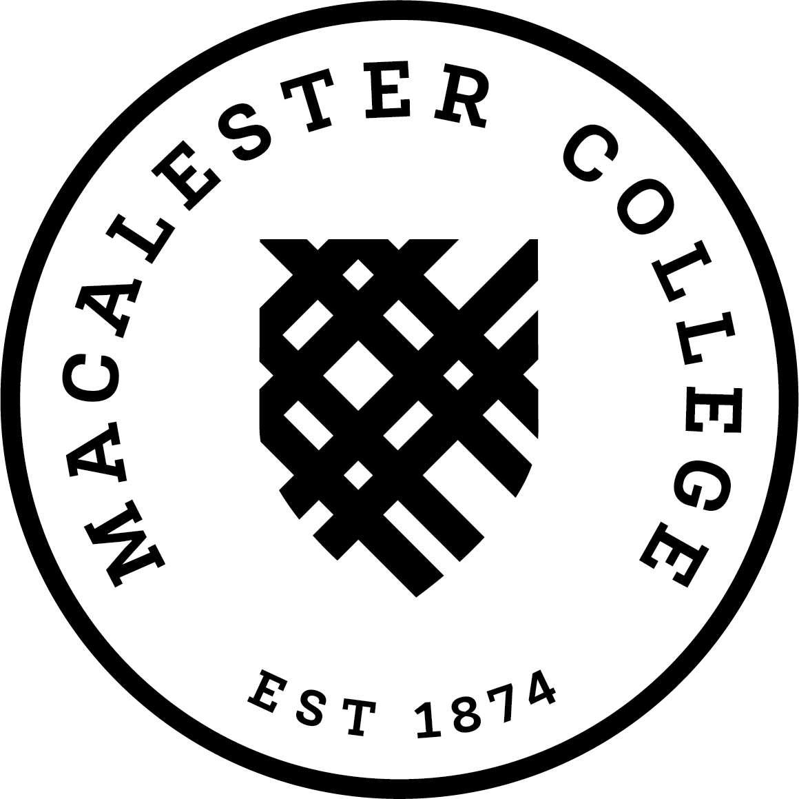

```{r setup, include=FALSE}
knitr::opts_chunk$set(echo = FALSE)
```

```{r libraries}
library(tidyverse)
library(ggweekly)
library(downloadthis)
```

{width=20%}


Welcome to the Advanced Data Science in R course being taught by me, Lisa Lendway. The syllabus and calendar for the course can be found on the course Moodle page, which is where you will also submit assignments. Materials for each topic we cover can be found on the Course Materials page of this website. I also included a page with all the resources I will use and a page with the assignments. 


